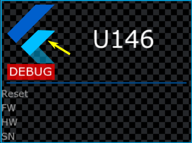
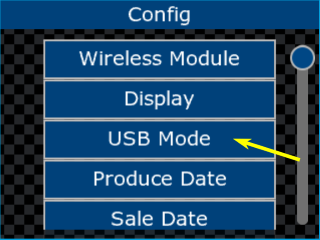
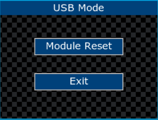
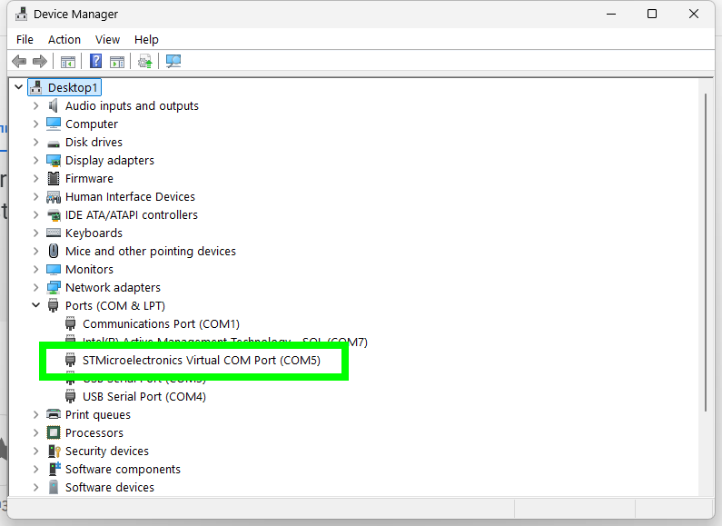

# U146 Digi Xbee firmware update

## 1. Download the Digi Module firmware update software

#### Links:

[XCTU v. 6.5.13 Windows x86:x64](https://hub.digi.com/dp/path=/support/asset/xctu-v-659-windows-x86x64/)

[Other link](https://mega.nz/file/i1BCBThR#0w04i5rBk8fXqWikXiKLzcNax-2XMo_vop1elhghPG0)

# 2. Connecting the U146 controller to the PC

### Step 1 

- Connect the controller via USB cable to the computer (no external power required)

- Click 3 times on the controller logo icon

   

*The controller enters configuration mode.*

### Step 2 

- Select `USB Mode` from the configuration menu.

  

- After the `USB mode` screen appears, the computer must find the USB port.

  

- A new Com Port will appear in the Windows `Control Panel`/`Device Manager` with the name: `STMicroelectronics Virtual COM Port` 

  

 

