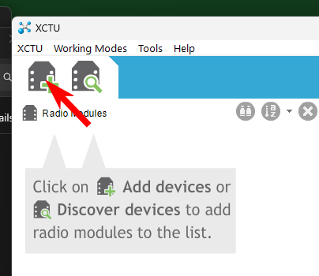
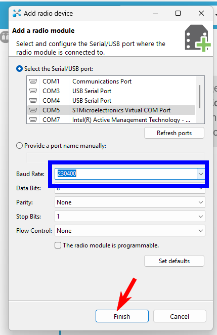
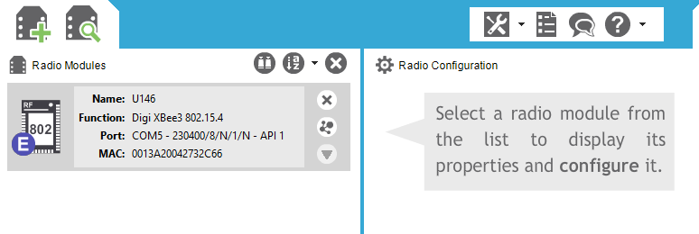
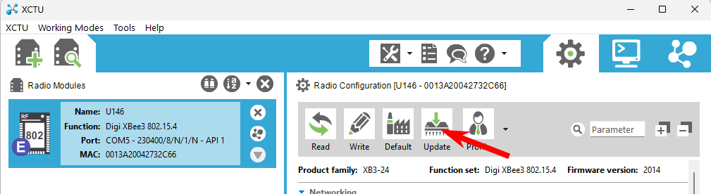
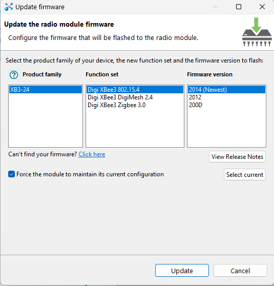
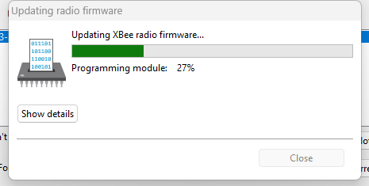
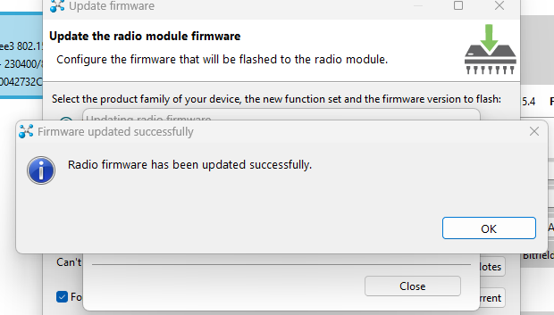

# U146 Digi Xbee firmware update

1. Download the Digi Module firmware update software

*Links:*

[XCTU v. 6.5.13 Windows x86:x64](https://hub.digi.com/dp/path=/support/asset/xctu-v-659-windows-x86x64/)

[Other link](https://mega.nz/file/i1BCBThR#0w04i5rBk8fXqWikXiKLzcNax-2XMo_vop1elhghPG0)

2. Install the XCTU software
3. Connecting the U146 controller to the PC

- Connect the controller via USB cable to the computer (no external power required)

- Click 3 times on the controller logo icon

 

*The controller enters configuration mode.*

- Select `USB Mode` from the configuration menu.

  

- After the `USB mode` screen appears, the computer must find the USB port.

  

- A new Com Port will appear in the Windows `Control Panel`/`Device Manager` with the name: `STMicroelectronics Virtual COM Port` 

   

3. Start the XCTU software

4. Click the button to add a radio module

      

5. Select the COM Port that has `STMicroelectronics Virtual COM Port` in its name.

6. Select `Baud rate:` to `230400` and click button `Finish`
    

7.  Upon successful connection, the module should appear in the Radio modules panel.

     

8. Select the module
9. Select the `Update` button.
     

10. An `Update firmware` window will appear.

 

- Select the Firmware version that is marked as (Newest) - the current one is `2014(Newest)`.

- Click button `Update`.

- A firmware update window appears with the progress of the update. 
   

  **Please wait for it!** 

  If everything went successfully, a window will appear:
   

Update is complete, you can restart the controller.

